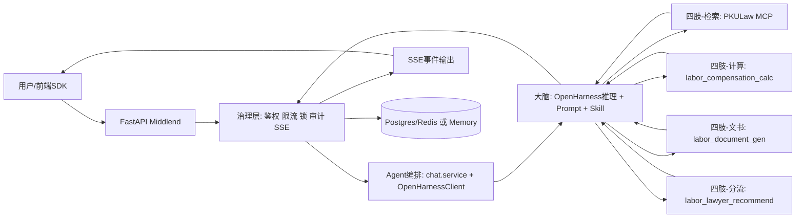
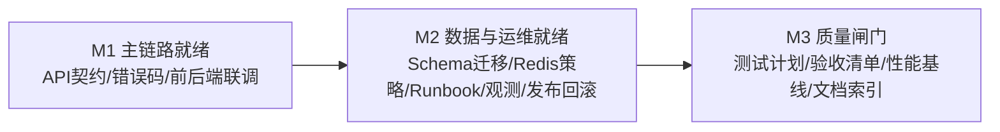

# LaborLawHelp Middlend 技术总结

## 1. 技术创新（对比通用大模型 / 套壳方案）

### 相比通用大模型直答
- 从“自由生成”切换为“先检索/先工具、后结论”的受控路径。
- 法律依据优先由 `mcp__pkulaw__*` 检索产出，降低法条幻觉。
- 赔偿金额必须通过 `labor_compensation_calc` 计算，避免模型心算。
- SSE 输出沉淀 `references / summary / rule_version / finish_reason`，支持可追溯复核。

### 相比套壳转发方案
- 中间层承担治理：鉴权、限流、会话锁、审计、错误映射、重试与降级。
- OpenHarness 三模式（`mock/library/remote`）可切换，并支持 MCP 自愈重连。
- `legal_minimal` 工具策略收敛工具面，提升“先检索后结论”执行率。

---

## 2. 技术路线：架构图 + 里程碑

### 2.1 架构图（Agent 与大脑/四肢调用关系）

图解说明：
- **大脑**负责推理与流程编排（先 skill、再检索、再结论）。
- **四肢**负责可执行能力（检索、计算、文书、转介）。
- **中间层**负责治理与契约稳定，把 AI 能力转为可审计、可复核的业务输出。

### 2.2 里程碑

---

## 3. Agent 调用链路（案型示例：陕西“违法解除”）

1. 前端发起 `POST /api/v1/sessions/{session_id}/chat/stream`。  
2. `chat/router` 做会话状态与限流校验。  
3. `chat/service` 落用户消息、创建 `trace_id`、发 `message_start`。  
4. 进入 `OpenHarnessClient.stream_run`（library 模式）：注入中间件提示词并约束工具流程。  
5. 先调用 `skill(name="labor-pkulaw-retrieval-flow")`，再调用 `mcp__pkulaw__*` 检索法条。  
6. 需要时调用 `labor_fact_extract`、`labor_compensation_calc`、`labor_document_gen`、`labor_lawyer_recommend`。  
7. 中间层将工具结果归一为 `references` 与 `card_*`，持续发送 `tool_result/content_delta`。  
8. 最终发送 `final(summary/references/rule_version/finish_reason)` 并 `message_end` 收尾。  
9. 同步写入 assistant metadata 与审计日志（`turn_completed` / `turn_failed`）。  

---

## 4. 技术成熟度与验证数据（需与段律共同完成）

当前已具备：
- 自动化测试覆盖主链路、SSE、权限、限流、JWT、审计、OpenHarness 适配。
- 质量门槛已定义（并发、首 token 延迟、全响应延迟、流错误率、5xx）。
- 可观测指标与告警项已定义（成功率、延迟、锁冲突、降级触发等）。

待与段律补齐：
- 分案型准确性与法律依据核验通过率（人工复核口径）。
- 真实场景稳定性报表（周/月趋势）。
- 人工兜底触发率、复核效率与用户侧满意度数据。

---

## 5. 风险控制与兜底机制（法律场景重点）

- **反胡说**：先检索后结论；未核验依据必须显式标注“待在线核验”。  
- **防金额幻觉**：金额强制工具计算，禁止模型估算。  
- **工具收敛**：`legal_minimal` 限制工具面，降低无关调用。  
- **错误治理**：统一错误码 + `retryable` 标记 + SSE 必有 `message_end` 收尾。  
- **鲁棒性**：上游重试退避、MCP 失败重连、异常时可降级输出可用信息。  
- **审计追踪**：`trace_id` 全链路透传，保留成功/失败审计事件便于复盘。  
